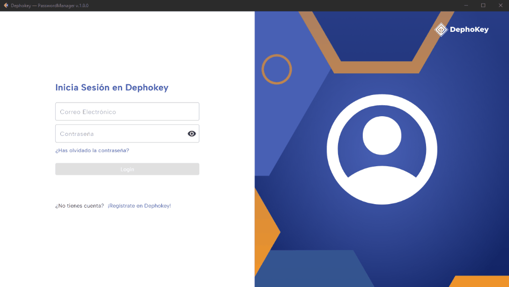
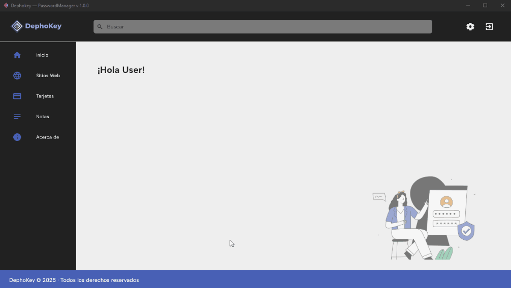
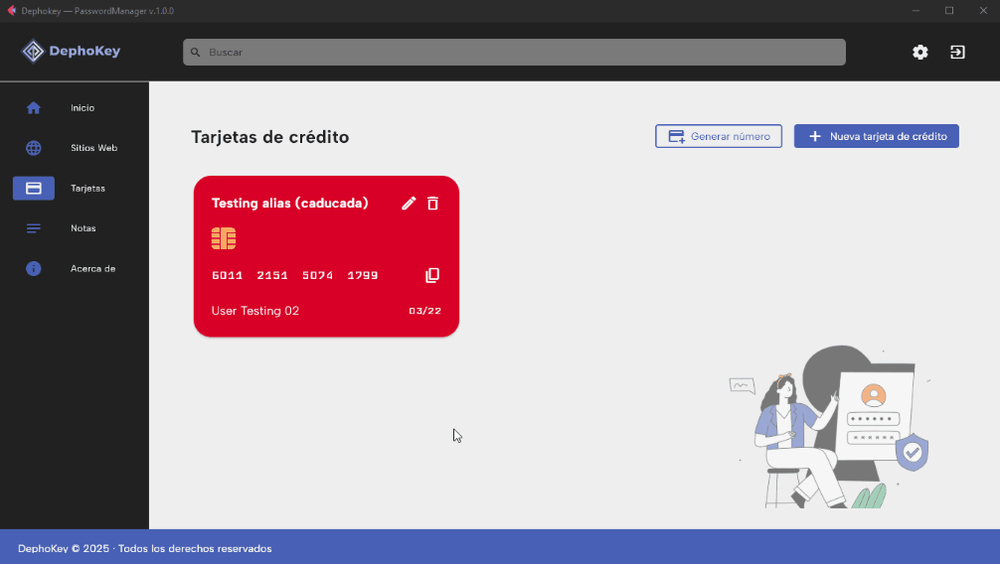
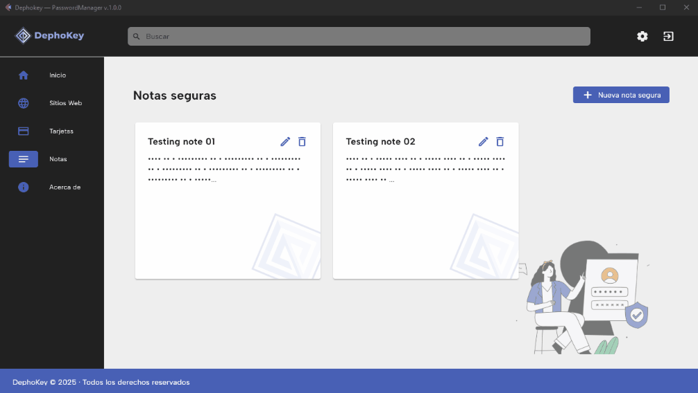
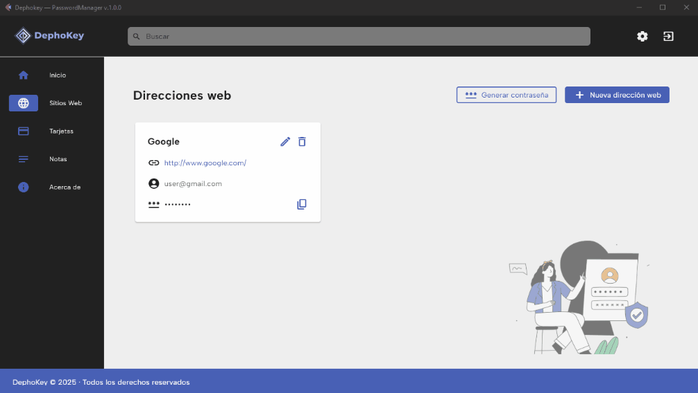
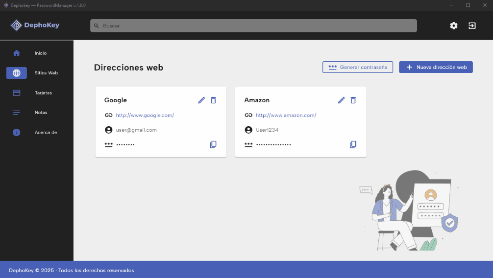
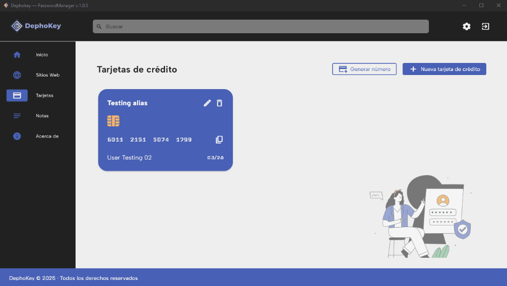

# Dephokey — PasswordManager v.1.0.0 

Dephokey — PasswordManager v.1.0.0 is an application that stores sensitive data under an encryption key within its own 
database. It avoids connecting to third-party servers, keeping all data and its credentials under the user's control, 
thus respecting their privacy. 

You can see our roadmap here: \
[](docs/roadmap.md)

And the complet project here: \
[](docs/Password_Manager_v.1.0.0.pdf)

---

## User Guide

_This guide will show you which features this app has with GIF examples._

### How to create a new account
To create a new account, navigate to the Sign-up page, fill in the text fields and press the submit button. The app 
will redirect you to the Login page automatically.


---

### How to sign in on the app
To sign in, fill in the text fields on main page and press the submit button. The app will redirect you to the home 
page.



---

### How to recover your account
**NOTE: Be sure you have Docker installed and running on your computer before enabling this feature (see the 
installation guide).** \
First, navigate to the Reset Password page and write your registered email. Check your email and come back to the 
app with the given token. Finally, complete the text fields in the form and submit it. Your password will be changed!


---

### How to add elements
You must choose what you want to add to the database. This example shows how to add a new website.
First, click on the add button. Fill in the form with the necessary data and submit it. Your new site will appear on the
Sites page.



---

### How to edit elements
All widgets have an edit button. You will find it near the close button. \
When you click on it, an edit form will appear. Now you can update all the data and submit it. Your new info will 
appear on its page as shown in the next example.



---

### How to delete elements
All widgets have a delete button. \
When you click on it, a dialog alert will ask you if you want to continue and the page will be updated after 
confirmation.



---

### How to send feedback
**NOTE: Be sure you have Docker installed and running on your computer before enabling this feature (see the 
installation guide).** \
First navigate to the About page. Then you can in the form and send it to our offices. Of course, we will respond 
as soon as possible!



---

### How to delete your account
To delete your account, navigate to the Settings page and click on the Delete Account button.
A dialog alert will ask you if you want to continue, and then the app will log you out and redirect you to the Login 
page.



---

### Generators
This app includes some extra tools: A secure password generator and a credit card number generator. Both of them can 
be used to add new test elements to the database.

**Password Generator** \


**Credit Card Number Generator** \


---

## Installation Guide
First ensure you have Python v.3.11.5 or later, Git v.2.45.1 or later and Docker v28.0.1 or later 
installed on your computer (note: Docker **is not essential** for this app, it just allows you to work with emails). 
You can download them from these URLs:


[](https://www.python.org/downloads/)
[](https://git-scm.com/downloads)
[](https://www.docker.com/)

### 🔹 Create a folder
Open your favorite IDE, create a new folder and navigate into it
```
# Creates folder
mkdir <new_folder>

# Navigate into it
cd <new_folder>
```

---

### 🔹 Clone the repository
Once you are inside your new folder, you can clone this repo with the following command:
```
git clone https://github.com/Ildiar25/dephokey
```
This creates a new folder named `dephokey`. Navigate into it with the command `cd dephokey`.

---

### 🔹 Create a virtual environment
Now, you need a new virtual environment. To create a new one, please follow the steps below:
```bash
python -m venv .venv
```
Once it is created, activate it with the following instructions:

**From PowerShell:**
```bash
.venv\Scripts\Activate.ps1
```

**From CMD:**
```bash
.venv\Scripts\activate.bat
```

*__ATTENTION:__ When you try to activate it you can get the following message:*
```
+ .venv/Scripts/Activate.ps1
+ ~~~~~~~~~~~~~~~~~~~~~~~~~~
    + CategoryInfo          : SecurityError: (:) [], PSSecurityException
    + FullyQualifiedErrorId : UnauthorizedAccess
```

That's because Windows has script execution disabled by default. \
You can solve this problem by opening Windows PowerShell in Administrator Mode and running the following command. Then 
answer _'yes'_:
```
Set-ExecutionPolicy -Scope CurrentUser -ExecutionPolicy Unrestricted
```

Now, you can activate the virtual environment.

---

### 🔹 Install Dependencies
This app needs some dependencies, and you can install them automatically by running the following command:
```bash
pip install -r requirements.txt
```

---

### 🔹 Start Email Server
This command opens port 1025 on localhost in detached mode (make sure Docker is running before)
```bash
docker compose -f compose.yaml up -d
```

---

### 🔹 Run Tests
Before using the app, you will need to check if all features are working correctly. To do that, you must run 
the python tests with the following command:
```bash
python -m unittest discover tests
```

---

### 🔹 Run the app
Now, your app is ready to run. Enjoy it!
```bash
flet run app.py
```

---

### 🔹 Stop the server
Once you are finished, you can stop the server with the following command:
```bash
docker compose -f compose.yaml down
```

---


---

### About me

Hi! I'm Joan and this is my first major project! I'm learning programming since 2024, and I'm more than glad to show 
off my progress with you all! I hope you enjoyed this app as I'd enjoyed to program it thus your feedback is very 
important to me. See you on my next project and thank you very much! \
Best regards!


Joan \
Ps: You can contact me or see my works from these URLs:

[](
https://www.linkedin.com/in/joan-pastor-vicens-aa5b4a55)
[](https://github.com/Ildiar25)

See you coding! 😜
